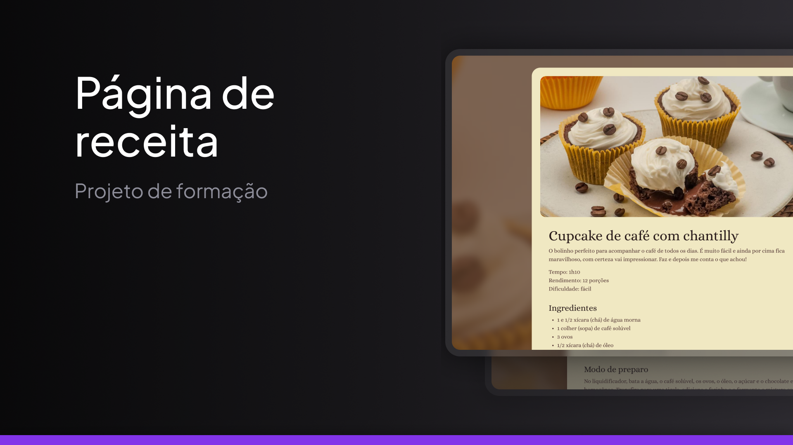

<h1 align="center"> Recipe page </h1>

Uma página sobre uma receita de cupcake fictício feito como forma de estudos do curso Fullstack da Rocketseat

<a href="https://guilhermedkdk.github.io/page-recipe/">🔗 Live Preview</a>&nbsp;&nbsp;&nbsp;|&nbsp;&nbsp;&nbsp;
<a href="#-tecnologias">🚀 Tecnologias</a>&nbsp;&nbsp;&nbsp; |&nbsp;&nbsp;&nbsp;&nbsp;
<a href="#-projeto">💻 Projeto</a>&nbsp;&nbsp;&nbsp;|&nbsp;&nbsp;&nbsp;
<a href="#-aprendizados">📚 Aprendizados</a>

## 🚀 Tecnologias

Esse projeto foi desenvolvido com as seguintes tecnologias:

- HTML e CSS
- Git e Github
- FIGMA

## 💻 Projeto

A "Recipe page" foi um pequeno projeto do curso Fullstack da Rocketseat no módulo "Iniciando HTML e CSS". Nele, apliquei conceitos fundamentais de HTML e CSS, como elementos, atributos, seletores, box model, fontes e cores, consolidando os conhecimentos adquiridos nas aulas.

## 📚 Aprendizados

Este projeto foi feito dentro do curso de Fullstack no módulo "Iniciando HTML e CSS" da Rocketseat.
Nele pude consolidar os conhecimentos sobre:
### HTML
- Elementos
- Atributos
- Caminhos absolutos e relativos
### CSS
- Seletores e Combinators
- Box model e Display
- Fontes
- Cores
- Fundos
